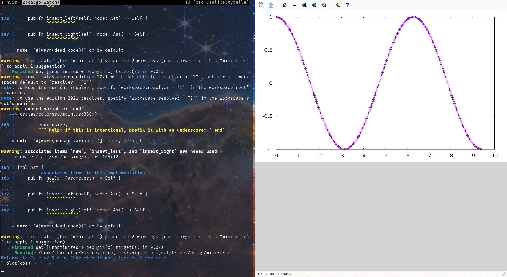
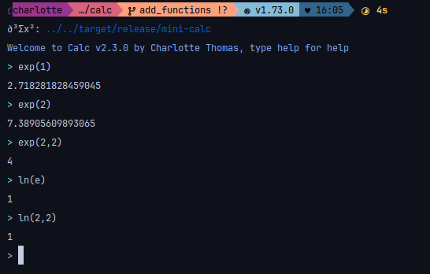

# Calc

<div align="center">

**Calc: A fully-featured minimalistic configurable rust calculator**

[](https://github.com/coco33920/calc/actions/workflows/rust-test.yml)
[](https://github.com/coco33920/calc/releases/latest)
[](https://crates.io/crates/mini-calc)

[](https://crates.io/crates/mini-calc)

</div>

## Install

You can install the latest version from source

```bash 
git clone https://github.com/coco33920/calc
cd calc 
cargo build --release
./target/release/mini-calc
```

or install it via cargo

```bash 
cargo install mini-calc
```

## Website
The website (powered by oranda) is available for more informations [the website](https://calc.nwa2coco.fr) for more informations.

## Contributors

|                                                                                                                                               | Name    | Role                     | Website                                     |
|-------------------------------------------------------------------------------------------------------------------------------------------------|:--------|:-------------------------|:--------------------------------------------|
| [](https://github.com/coco33920)        |Charlotte THOMAS          | Main developer/Maintener | [Main page](https://me.nwa2coco.fr)         | 
| [](https://github.com/leana8959)        |Léana 江                  | Help, cleanup            | [Website/Blog](https://earth2077.fr)        |

## TODO List

- [X] Lexing of basic operations
    - [X] Lexing operators
    - [X] Lexing lpar,rpar,quote
    - [X] Lexing int
    - [X] Lexing floats
    - [X] Lexing identifiers
- [X] Parsing of basic operations
    - [X] Parsing int,floats,identifiers
    - [X] sum operation
    - [X] minus operation
    - [X] multiplication operation
    - [X] division operation
- [X] Parsing advanced operations
    - [X] Parsing lpar,rpar
    - [X] mathematical priority
        - [X] Left priority
        - [X] Right priority
    - [X] parenthesis support
    - [X] Assignment
    - [X] associativity support
        - [X] Left associativity
        - [X] Right associativity
- [X] Application REPL
    - [X] Add the REPL
        - [X] basic REPL
        - [X] colour message
        - [X] colourised prompt
    - [X] Add colour
- [X] Interpreter
    - [X] Basic operation interpreter
    - [X] Advanced operation interpreter
    - [X] Identifiers (variable) interpreter
- [X] Built-in
    - [X] pi
    - [X] e
- [X] Config
    - [X] Config colours
    - [X] Config prompt
- [X] Add more operations
    - [X] exponent
- [X] Add support for functions
    - [X] exp
    - [X] ln
    - [X] log base a
    - [X] cos/sin/tan
    - [X] cosh/sinh/tanh
    - [X] atan/acos/asin
- [X] Add logic
    - [X] Add basic true/false
    - [X] Add binary operator
        - [X] or (&&)
        - [X] and (||)
        - [X] `>=`
        - [X] `>`
        - [X] `<=`
        - [X] `<`
        - [X] `==`
    - [X] Add unary operator
        - [X] not (!)
- [X] Vector calculation
    - [X] Add vectors to the datatypes
    - [X] Lex vectors
    - [X] Parse vectors
    - [X] Add vector operations
      - [X] Dot product
      - [X] Vector norm
      - [X] Vector addition
- [X] Matrix calculation
    - [X] Add matrix to the datatypes
    - [X] Lex matrices
    - [X] Parse matrices
    - [X] Add matrices operation
      - [X] Matrix addition
      - [X] Matrix multiplication
      - [X] Calculate the matrix determinant
      - [X] Calculate the reverse matrix
- [X] Interact with the configuration
    - [X] Print current config
    - [X] Reset config to default
    - [X] Set config
      - [X] Set main color
      - [X] Set prompt color
      - [X] Set prompt 
      - [X] Set greeting message
      - [X] Set greeting color 
    - [X] Reload config

## Evolution

### Ploting

Plot functions (both stdlib, and runtime) would be useful and appreciated.
Plotting is powered by gnuplot, it will works on Unix-like (MacOS, Linux) but I don't have any idea about Windows

- [X] Plot stdlib functions
- [X] Plot runtime functions
- [X] Save plot to png/svg/pdf

- [X] Add terminal ploting
    - [X] Calculate ploting height and width
    - [X] Computes individual points
    - [X] Generate each line
    - [X] Prints each line

- [X] Auto level x axis in termplot
- [X] Auto level y axis in termplot

#### Example of plotting

You can plot function defined in the standard library of calc or user defined functions, to display the help just type `plot()`


You can then plot for example

Plotting cos with the default values (from 0 to 3pi, with a step of 0.01pi)



Plotting sin with custom values (from -pi to pi, with a step of 0.01rad, with line, title, x label, y label)


Defining f(x) = x² and plotting it with custom values (from -10 to 10, with a step of 0.1, with linespoint)


#### Example of terminal plotting

You can plot in the terminal, for example 


And it supports the labels too


And now it auto scales on y!


### Exact math calculator

As this project provides a frontend with a parser we could plug an exact math engine in the backend to transform `calc` into a 
real exact math calculator.
TODO List for the Exact Math Engine

- [X] Rational calculation
  - [X] Implement rational numbers operations 
  - [X] Rational reduction
- [ ] Irrational calculation 
  - [ ] Implement irrational numbers operations
  - [ ] Irrational reduction
- [ ] Literal calculation
  - [ ] Computes literal expression with uninitialized operators
  - [ ] Literal reduction

#### Example of rational computations

As of 2.11.0 the support for rational exact math has been implemented


As of 2.11.1 it works in matrices!


### CAS

If we ever go to this step, yes, I will remove the "minimalistic" from the description
- [ ] It's hard.

## Examples

### REPL with only Lexing (verbose mode: on by default)


### REPL with lexing and basic operation parsing (verbose mode: on by default)


### REPL and functionning interpreter (verbose mode: off by default)


## Configuration

You can configure the general color, greeting message, greeting color, prompt and prompt color from the file for example
in (for linux)

```
~/.config/mini-calc/mini-calc.toml
```

Or situated in your operating system config folder.


You can interact with the configuration with the command line, more info in [the web page](https://calc.nwa2coco.fr/config.html)


### What the configuration looks like

The default configuration looks like this


### Colors

Available colors are

- purple
- cyan
- blue
- black
- red
- yellow
- green
- white
- an hexadecimal colour (ex: "#f7a8d8")

Default colour (if the configuration fail to load) is Cyan.

### Example of a modified configuration

Configuration:


It looks like:


## Functions

The following functions are available

- sin
- cos
- tan
- sinh
- cosh
- tanh
- asin
- acos
- atan
- exp
- ln (alias: log)
- sqrt
- factorial (alias: fact)
- abs
- ceil
- floor
- round

### Trigonometry

For trigonometry, the input are assumed to be in radian, if not, you have to put "false" or "true" as second argument,
example shown bellow


### Exp/ln

If you use the exp function you can pass a second argument for the base you are using, if no second arguments are passed
this is assumed to be in natural base



### Root

You can take the nth root with the sqrt function, by default it takes the second root.


### Round

You can round to the nth decimal with the round function, by default it round to the integer (floor)


### Vectorization 

Function are now vectorized! Just pass a vector as an argument!


## Logic

You can now use logic! I implemented the following functions:

- or (alias : ||)
- and (alias : &&)
- geq (alias : `>=`)
- gt (alias : `>`)
- leq (alias : `<=`)
- lt (alias :`<`)
- eq (alias : `==`)

Example:


## User defined functions!

You can define your own functions!


## Vector calculation !

You can use vectors! 

- add vector to each others
- added the `norm` function to compute the norm
- dot product between two vectors ( * operator)

Functions added: 
- norm


## Matrices !

As of 2.7.0 matrix algebra is implemented (using lup reduction)

- you can add matrices 
- multiply compatible matrices

functions added
- transpose
- invert
- det 


